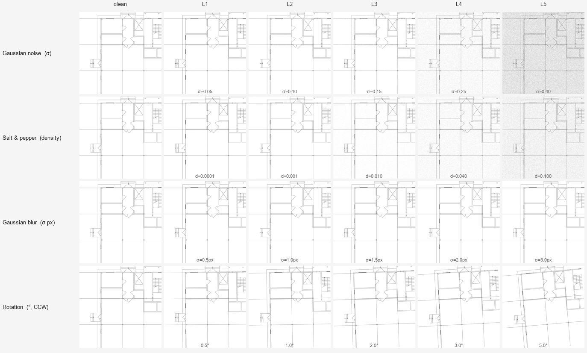

# Vectorization Dataset — Architectural Drawings

> **[English](#english) | [Русский](#русский)**

---

<a name="english"></a>

## English

**Navigation:**
[Dataset structure](#dataset-structure) ·
[Noise types](#noise-types-and-levels) ·
[Requirements](#requirements) ·
[Quick start](#quick-start) ·
[Scripts reference](#scripts-reference) ·
[manifest.json](#manifestjson-format) ·
[Adding a drawing](#adding-a-new-drawing) ·
[**Preparing source DXF**](#preparing-source-dxf-files)

Synthetic dataset for research on the influence of line segment clustering algorithms
(DBSCAN, K-Means, MeanShift) on hybrid vectorization accuracy at various noise levels.

Each sample consists of a rasterized architectural drawing crop (TIFF) and a
ground-truth DXF file containing the exact LINE segments in pixel coordinates.

---

### Dataset structure

```
Dataset/
├── sources/                        # Preprocessed DXF source files
│   └── 1_geometry_only.dxf
│
├── drawings/
│   └── 001/                        # One folder per drawing (zero-padded)
│       ├── metadata.json           # Rasterization parameters and crop grid info
│       ├── images/
│       │   ├── clean/              # Clean rasterized crops (1-bit TIFF)
│       │   │   ├── crop_0000.tiff
│       │   │   └── ...
│       │   └── noisy/              # Noisy variants
│       │       ├── gaussian_noise_L1/   # 1-bit TIFF
│       │       ├── gaussian_noise_L2/
│       │       ├── ...
│       │       ├── salt_pepper_L1/      # 1-bit TIFF
│       │       ├── ...
│       │       ├── gaussian_blur_L1/    # 8-bit grayscale TIFF *
│       │       ├── ...
│       │       ├── rotation_L1/         # 1-bit TIFF
│       │       └── ...
│       └── gt/
│           ├── crop_0000.dxf       # Ground truth — pixel coords, Y-up
│           └── rotation/           # Rotated GT (only for rotation noise)
│               ├── L1/
│               │   └── crop_0000.dxf
│               └── ...
│
├── manifest.json                   # Global dataset manifest (all drawings)
└── scripts/
    ├── run.py                      # Interactive menu (entry point)
    ├── preprocess_dxf.py
    ├── make_crops.py
    └── add_noise.py
```

> \* `gaussian_blur` crops are saved as 8-bit grayscale because binary thresholding
> at 0.5 erases 2 px lines at σ > ~1.1 px. All other noise types produce 1-bit TIFF.

---

### Noise types and levels

| Type | Parameter | L1 | L2 | L3 | L4 | L5 |
|---|---|---|---|---|---|---|
| `gaussian_noise` | sigma | 0.05 | 0.10 | 0.15 | 0.25 | 0.40 |
| `salt_pepper` | density | 0.0001 | 0.001 | 0.010 | 0.040 | 0.100 |
| `gaussian_blur` | sigma (px) | 0.5 | 1.0 | 1.5 | 2.0 | 3.0 |
| `rotation` | angle (deg, CCW) | 0.5 | 1.0 | 2.0 | 3.0 | 5.0 |



> Preview generated by `scripts/make_preview.py` (see [below](#make_previewpy--noise-preview)).

For `rotation` the ground truth DXF is also rotated and stored in `gt/rotation/L{n}/`.
All other noise types share the clean GT from `gt/`.

Per drawing: 6 crops × (1 clean + 20 noisy) = **126 samples**.

---

### Requirements

```bash
pip install ezdxf Pillow numpy scipy
```

Python 3.10+.

---

### Quick start

> **Note:** the repository contains only source DXF files and scripts.
> The rasterized dataset (~2 GB for 8 drawings) is generated locally and is not committed to git.
> To build the full dataset, run the pipeline for all sources (menu option **5**):

```bash
cd Dataset/
python scripts/run.py
```

The interactive menu guides through all pipeline steps.

---

### Scripts reference

#### `run.py` — interactive menu

```bash
python scripts/run.py
```

Menu options:

| # | Option |
|---|---|
| 1 | Preprocess DXF — convert all primitives to LINE segments |
| 2 | Rasterize & crop one drawing |
| 3 | Generate noisy variants for one drawing |
| 4 | Full pipeline (steps 1–3) for one drawing |
| 5 | Full pipeline (steps 1–3) for ALL drawings |
| 6 | Dataset statistics |
| c | Delete all generated data (drawings/ and manifest.json) |

---

#### `preprocess_dxf.py` — DXF preprocessing

Converts all geometry primitives to individual LINE entities **in-place**:
`LWPOLYLINE` → segments (including bulge arcs), `CIRCLE` / `ARC` / `ELLIPSE` → chord approximation.

```bash
# Process all *_geometry_only.dxf in sources/ (default)
python scripts/preprocess_dxf.py --units m

# Specific folder or file
python scripts/preprocess_dxf.py path/to/sources/ --units m
python scripts/preprocess_dxf.py path/to/file.dxf --units m
```

| Argument | Default | Description |
|---|---|---|
| `path` | `sources/` | File or folder to process |
| `--units` | from `$INSUNITS` | Drawing units: `mm`, `cm`, `m`, `inch`, `ft`, or a number (mm/unit) |
| `--dpi` | `300` | Target DPI for arc approximation tolerance |
| `--min-radius-mm` | `2.0` | Circles/arcs smaller than this (mm on paper) are skipped |
| `--delta-px` | `0.5` | Max chord deviation in pixels for arc approximation |

> **Note:** the `$INSUNITS` header in many CAD files is incorrect.
> Always specify `--units` explicitly if you know the coordinate units.

---

#### `make_crops.py` — rasterization and cropping

Rasterizes a preprocessed DXF to a 1-bit TIFF and slices it into a grid of crops.
For each crop a GT DXF is generated with line coordinates in pixels (Y-up, DXF convention).

```bash
# Dry-run: show resolution info without creating files
python scripts/make_crops.py sources/1_geometry_only.dxf --scale 100 --units m --dry-run

# Rasterize and crop
python scripts/make_crops.py sources/1_geometry_only.dxf --scale 100 --units m
```

| Argument | Default | Description |
|---|---|---|
| `dxf` | required | Path to the source DXF file |
| `--scale` | required | Drawing scale denominator (e.g. `100` for 1:100) |
| `--units` | from `$INSUNITS` | Drawing units (same as `preprocess_dxf.py`) |
| `--dpi` | `300` | Rasterization DPI |
| `--crop-size` | `2048` | Grid tile size in pixels (step basis) |
| `--overlap` | `256` | Tile overlap in pixels; step = crop_size − overlap |
| `--offset` | `0` | Context padding around each tile (px); output TIFF = crop_size + 2×offset |
| `--line-width` | `2` | Line width in pixels during rasterization |
| `--min-segments` | `10` | Skip crops whose GT contains fewer LINE segments (0 = disabled) |
| `--output-dir` | `drawings/{id:03d}/` | Override output directory |
| `--dry-run` | off | Print resolution info only, do not create files |

**Output** is written to `drawings/{id:03d}/`:

```
drawings/001/
    metadata.json
    images/clean/crop_0000.tiff  ...
    gt/crop_0000.dxf  ...
```

**GT DXF coordinate system:** pixel coordinates, origin at the top-left corner of the
crop, Y-axis pointing up (DXF convention). `y = 0` is the bottom edge,
`y = out_size` is the top edge.

---

#### `add_noise.py` — noise generation

Generates all noisy variants of the clean crops for one drawing.
Reads from `drawings/{id}/images/clean/`, writes to `drawings/{id}/images/noisy/`.
Updates the global `manifest.json` (idempotent — reruns replace old entries for the drawing).

```bash
# All noise types and levels
python scripts/add_noise.py drawings/001

# One noise type only
python scripts/add_noise.py drawings/001 --noise gaussian_blur

# One noise type, one level
python scripts/add_noise.py drawings/001 --noise rotation --level L3

# Disable edge-blur pre-softening
python scripts/add_noise.py drawings/001 --edge-blur 0
```

| Argument | Default | Description |
|---|---|---|
| `drawing_dir` | required | Path to drawing folder, e.g. `drawings/001` |
| `--noise` | all | Process only this noise type |
| `--level` | all | Process only this level (`L1`–`L5`) |
| `--edge-blur` | `1.0` | Gaussian pre-softening σ before `gaussian_noise` (simulates scan digitization) |
| `--seed` | `42` | Random seed for reproducibility |

---

#### `make_preview.py` — noise preview

Generates a PNG grid showing all noise types × all levels.
Works without running the full pipeline — uses the first available clean crop
from `drawings/`, or falls back to a synthetic image.

```bash
python scripts/make_preview.py          # saves to docs/noise_preview.png
python scripts/make_preview.py --size 256  # larger cells
python scripts/make_preview.py --source drawings/001/images/clean/crop_0000.tiff
```

| Argument | Default | Description |
|---|---|---|
| `--source` | auto | Input TIFF crop (auto-detected or synthetic if not found) |
| `--size` | `192` | Cell size in pixels |
| `--output` | `docs/noise_preview.png` | Output path |
| `--seed` | `42` | Random seed |

---

### manifest.json format

The global manifest accumulates entries from all drawings.
Each entry in `samples` describes one (image, GT) pair:

```json
{
  "id":           "001_crop_0000_gaussian_noise_L3",
  "drawing_id":   "001",
  "crop_id":      "crop_0000",
  "noise_type":   "gaussian_noise",
  "noise_level":  3,
  "params":       { "sigma": 0.15 },
  "image":        "drawings/001/images/noisy/gaussian_noise_L3/crop_0000.tiff",
  "gt":           "drawings/001/gt/crop_0000.dxf"
}
```

For clean samples `noise_type` is `null` and `noise_level` is `0`.
For `rotation` samples `gt` points to the rotated GT in `gt/rotation/L{n}/`.
All paths are relative to the `Dataset/` root and use forward slashes.

---

### Adding a new drawing

1. Place the converted DXF as `sources/N_geometry_only.dxf`.
2. Run the full pipeline:

```bash
python scripts/preprocess_dxf.py sources/N_geometry_only.dxf --units m
python scripts/make_crops.py     sources/N_geometry_only.dxf --scale 100 --units m
python scripts/add_noise.py      drawings/00N
```

The drawing is assigned ID `00N` automatically and its samples are appended to `manifest.json`.

---

### Preparing source DXF files

Two types of DXF files are used. Both must be **prepared in CAD before running any scripts**.

---

#### `*_geometry_only.dxf` — vectorization ground truth

This file contains only the structural geometry of the drawing.
The scripts rasterize it to a binary TIFF and use it as ground truth for line vectorization.

**What to include:**

| Element | Include? | Notes |
|---|---|---|
| Walls, slabs, beams | ✅ Yes | Core structural geometry |
| Doors, windows (geometry) | ✅ Yes | Explode blocks first (see below) |
| Round columns | ✅ Yes | Leave as CIRCLE — script converts them to LINE segments |
| Circular staircases | ✅ Yes | Structural, keep |
| Stair direction arrows | ❌ Remove manually | Annotation symbol, not geometry |
| Room number symbols (circle + number) | ❌ Remove manually | Small arcs end up as short segments; the number text clutters GT |
| Sanitary equipment (toilet, sink, bath) | ❌ Remove manually | Complex contours produce false PHT detections |
| Furniture | ❌ Remove manually | Non-structural noise |
| Hatching (HATCH) | ❌ Remove manually | Filled regions — script deletes automatically, but cleaner to remove in CAD |
| Text, dimensions | ❌ Remove manually | Handled separately in `*_full_annotated.dxf` |
| Title block / stamp | ❌ Remove manually | Not architectural geometry |
| Sheet frame (A3/A4 border) | ❌ Remove manually | Lines would be falsely detected as walls |
| Small symbolic circles (< 2 mm on paper) | ❌ Remove manually | Filtered by `--min-radius-mm 2.0`, but removal in CAD is cleaner |

**Preparation steps in AutoCAD / BricsCAD:**

1. **Explode everything to primitives** (`EXPLODE` → repeat until no blocks remain).  
   *Exception: do NOT explode CIRCLE — AutoCAD cannot decompose circles into arcs.
   `preprocess_dxf.py` converts CIRCLE → LINE segments automatically.*

2. **Move all geometry to layer `0`** (or keep original layers — the script preserves layer info).

3. **Set color to `ByLayer` or black/white** — color is irrelevant for rasterization, but consistent styling helps visual review.

4. **Delete all non-geometry entities**: TEXT, MTEXT, DIMENSION, HATCH, LEADER, TABLE, viewport frames, etc.

5. **Save as DXF** (version R2010 or later recommended).

6. **Name the file** `N_geometry_only.dxf` and place in `sources/`.

> **Verify:** Run `python scripts/preprocess_dxf.py sources/N_geometry_only.dxf --units m`.  
> The output should show `INSERT(exploded): 0` or a small number.  
> If `INSERT: N` is large (> 10) — there are unexploded blocks, go back to step 1.

---

#### `*_full_annotated.dxf` — YOLO detection training data

This file contains the full drawing including all annotations.
The script extracts bounding boxes for text, dimensions, and tables and generates YOLO labels.

**What to include:**

| Element | Include? | YOLO class | Notes |
|---|---|---|---|
| All geometry (walls, doors, etc.) | ✅ Yes | — | Rasterized as background |
| TEXT, MTEXT | ✅ Yes | `text` (0) | Detected automatically |
| DIMENSION, MULTILEADER | ✅ Yes | `dimension` (1) | Detected automatically |
| LEADER (old-style) | ✅ Yes | `dimension` (1) | Detected automatically |
| Block attributes (ATTRIB) | ✅ Yes | `text` (0) | Explode blocks so ATTRIBs are accessible |
| Room numbers (circle + digit) | ✅ + manual markup **or** delete | `annotation_region` (2) | Mark the circle region with `YOLO_TABLE`, or simply delete if not worth the effort |
| Sanitary equipment, furniture | ✅ keep geometry **or** delete | — | Geometry stays as background; no annotation needed. Delete if it creates too much visual noise in crops |
| Tables (crude line grids with text inside) | ✅ + manual markup | `annotation_region` (2) | Layer `YOLO_TABLE` |
| Title block / stamp | ✅ + manual markup | `annotation_region` (2) | Layer `YOLO_STAMP` |
| Sheet frame (A3/A4/… border) | ✅ + manual markup | `annotation_region` (2) | Layer `YOLO_FRAME` |
| HATCH | ❌ Remove | — | Not used |

**Annotating mask regions (tables, title blocks, sheet frames):**

Three types of regions must be masked before line detection.
All three use the same approach — draw a bounding LWPOLYLINE on a dedicated layer:

| Region type | Layer name | What it covers |
|---|---|---|
| Table (line grid + text) | `YOLO_TABLE` | Room finish schedule, door schedule, any hand-drawn table |
| Title block / stamp | `YOLO_STAMP` | The lower-right (or lower) stamp with project info, scale, sheet number |
| Sheet frame | `YOLO_FRAME` | **2 polylines** (outer + inner border) → script auto-computes 4 border strips; or 1 polyline for a simple case |

All three layers map to the same YOLO class `annotation_region` (2).
The naming distinction is for documentation only; the masking behaviour is identical.

**Markup procedure (same for all three types):**

1. In CAD, create the layer if it does not exist (`YOLO_TABLE`, `YOLO_STAMP`, or `YOLO_FRAME`).
2. Draw a **closed LWPOLYLINE (rectangle)** that tightly encloses the region.
3. Move the polyline to the corresponding layer.  
   It will NOT be rasterized — it is only a bounding-box marker.
4. Leave the actual content (text, lines, dimensions) on its original layers.

> **Sheet frames:** A typical sheet has two frame rectangles (outer border and inner border with fold marks).
> Draw one LWPOLYLINE around the outermost border. A single bbox is sufficient.
>
> **Title blocks:** Draw the LWPOLYLINE around the entire stamp area including all cells and text.
> The individual text items inside are also detected as `text` (0) — that is expected and correct.

The script reads all LWPOLYLINE entities on these layers and records them as
`annotation_region` (class 2) bounding boxes in the YOLO labels.

**Preparation steps:**

1. Start from a complete drawing (all annotations present).
2. **Explode INSERT blocks** so that ATTRIB text is accessible at modelspace level.
3. Add `YOLO_TABLE` polylines around table regions (see above).
4. **Do not** move or rename TEXT/MTEXT/DIMENSION entities — the script reads them directly.
5. Save as `N_full_annotated.dxf` in `sources/`.

---
---

<a name="русский"></a>

## Русский

**Навигация:**
[Структура датасета](#структура-датасета) ·
[Типы шума](#типы-шума-и-уровни) ·
[Зависимости](#зависимости) ·
[Быстрый старт](#быстрый-старт) ·
[Справочник по скриптам](#справочник-по-скриптам) ·
[Формат manifest.json](#формат-manifestjson) ·
[Добавление чертежа](#добавление-нового-чертежа) ·
[**Подготовка исходных DXF**](#подготовка-исходных-dxf-файлов)

Синтетический датасет для исследования влияния алгоритмов кластеризации отрезков
(DBSCAN, K-Means, MeanShift) на точность гибридной векторизации архитектурных чертежей
при различных уровнях шума.

Каждый сэмпл — растровый кроп архитектурного чертежа (TIFF) и GT DXF с точными
LINE-сегментами в пиксельных координатах.

---

### Структура датасета

```
Dataset/
├── sources/                        # Препроцессированные DXF-источники
│   └── 1_geometry_only.dxf
│
├── drawings/
│   └── 001/                        # Папка каждого чертежа (нулевой padding)
│       ├── metadata.json           # Параметры растеризации и сетки кропов
│       ├── images/
│       │   ├── clean/              # Чистые кропы (1-bit TIFF)
│       │   │   ├── crop_0000.tiff
│       │   │   └── ...
│       │   └── noisy/              # Зашумлённые варианты
│       │       ├── gaussian_noise_L1/   # 1-bit TIFF
│       │       ├── gaussian_noise_L2/
│       │       ├── ...
│       │       ├── salt_pepper_L1/      # 1-bit TIFF
│       │       ├── ...
│       │       ├── gaussian_blur_L1/    # 8-bit grayscale TIFF *
│       │       ├── ...
│       │       ├── rotation_L1/         # 1-bit TIFF
│       │       └── ...
│       └── gt/
│           ├── crop_0000.dxf       # Ground truth — пиксельные координаты, Y↑
│           └── rotation/           # Повёрнутые GT (только для rotation)
│               ├── L1/
│               │   └── crop_0000.dxf
│               └── ...
│
├── manifest.json                   # Глобальный манифест (все чертежи)
└── scripts/
    ├── run.py                      # Интерактивное меню (точка входа)
    ├── preprocess_dxf.py
    ├── make_crops.py
    └── add_noise.py
```

> \* Кропы `gaussian_blur` сохраняются как 8-bit grayscale: бинаризация с порогом 0.5
> стирает линии толщиной 2 px при σ > ~1.1 px. Все остальные типы шума — 1-bit TIFF.

---

### Типы шума и уровни

| Тип | Параметр | L1 | L2 | L3 | L4 | L5 |
|---|---|---|---|---|---|---|
| `gaussian_noise` | sigma | 0.05 | 0.10 | 0.15 | 0.25 | 0.40 |
| `salt_pepper` | density | 0.0001 | 0.001 | 0.010 | 0.040 | 0.100 |
| `gaussian_blur` | sigma (px) | 0.5 | 1.0 | 1.5 | 2.0 | 3.0 |
| `rotation` | угол (град, CCW) | 0.5 | 1.0 | 2.0 | 3.0 | 5.0 |


> Превью генерируется скриптом `scripts/make_preview.py` (см. [ниже](#make_previewpy--превью-шумов)).

Для `rotation` GT DXF также поворачивается и хранится в `gt/rotation/L{n}/`.
Все остальные типы шума используют один GT из `gt/`.

На каждый чертёж: 6 кропов × (1 чистый + 20 зашумлённых) = **126 сэмплов**.

---

### Зависимости

```bash
pip install ezdxf Pillow numpy scipy
```

Python 3.10+.

---

### Быстрый старт

> **Важно:** репозиторий содержит только исходные DXF-файлы и скрипты.
> Растеризованный датасет (~2 ГБ для 8 чертежей) генерируется локально и не хранится в git.
> Для сборки полного датасета запустите пайплайн для всех исходников (пункт меню **5**):

```bash
cd Dataset/
python scripts/run.py
```

Интерактивное меню проведёт через все шаги пайплайна.

---

### Справочник по скриптам

#### `run.py` — интерактивное меню

```bash
python scripts/run.py
```

Пункты меню:

| # | Действие |
|---|---|
| 1 | Препроцессировать DXF — привести все примитивы к LINE-сегментам |
| 2 | Нарезать чертёж на кропы |
| 3 | Сгенерировать шумовые варианты для одного чертежа |
| 4 | Полный пайплайн (шаги 1–3) для одного чертежа |
| 5 | Полный пайплайн (шаги 1–3) для ВСЕХ чертежей |
| 6 | Статистика датасета |
| c | Удалить все сгенерированные данные (drawings/ и manifest.json) |

---

#### `preprocess_dxf.py` — препроцессирование DXF

Приводит все геометрические примитивы к отдельным LINE-сущностям **in-place**:
`LWPOLYLINE` → отрезки (включая bulge-дуги), `CIRCLE` / `ARC` / `ELLIPSE` → хордовая аппроксимация.

```bash
# Все *_geometry_only.dxf в sources/ (по умолчанию)
python scripts/preprocess_dxf.py --units m

# Конкретная папка или файл
python scripts/preprocess_dxf.py path/to/sources/ --units m
python scripts/preprocess_dxf.py path/to/file.dxf --units m
```

| Аргумент | По умолчанию | Описание |
|---|---|---|
| `path` | `sources/` | Файл или папка для обработки |
| `--units` | из `$INSUNITS` | Единицы чертежа: `mm`, `cm`, `m`, `inch`, `ft` или число (мм/ед.) |
| `--dpi` | `300` | DPI для расчёта точности аппроксимации дуг |
| `--min-radius-mm` | `2.0` | Окружности/дуги меньше этого значения (мм на бумаге) пропускаются |
| `--delta-px` | `0.5` | Максимальное отклонение хорды от дуги в пикселях |

> **Важно:** заголовок `$INSUNITS` во многих CAD-файлах заполнен некорректно.
> Всегда указывайте `--units` явно, если единицы чертежа известны.

---

#### `make_crops.py` — растеризация и нарезка

Растеризует препроцессированный DXF в 1-bit TIFF и нарезает по сетке.
Для каждого кропа создаётся GT DXF с координатами линий в пикселях (Y↑, DXF-конвенция).

```bash
# Dry-run: показать параметры без создания файлов
python scripts/make_crops.py sources/1_geometry_only.dxf --scale 100 --units m --dry-run

# Растеризация и нарезка
python scripts/make_crops.py sources/1_geometry_only.dxf --scale 100 --units m
```

| Аргумент | По умолчанию | Описание |
|---|---|---|
| `dxf` | обязательный | Путь к исходному DXF-файлу |
| `--scale` | обязательный | Знаменатель масштаба (например `100` для 1:100) |
| `--units` | из `$INSUNITS` | Единицы чертежа (аналогично `preprocess_dxf.py`) |
| `--dpi` | `300` | DPI растеризации |
| `--crop-size` | `2048` | Размер тайла в пикселях (основа шага сетки) |
| `--overlap` | `256` | Перекрытие тайлов в пикселях; шаг = crop_size − overlap |
| `--offset` | `0` | Контекстный отступ вокруг тайла (px); итоговый TIFF = crop_size + 2×offset |
| `--line-width` | `2` | Толщина линий при растеризации (px) |
| `--min-segments` | `10` | Пропускать кропы, у которых в GT меньше этого числа сегментов (0 = отключить) |
| `--output-dir` | `drawings/{id:03d}/` | Переопределить выходную папку |
| `--dry-run` | выкл. | Только показать параметры, не создавать файлы |

**Результат** записывается в `drawings/{id:03d}/`:

```
drawings/001/
    metadata.json
    images/clean/crop_0000.tiff  ...
    gt/crop_0000.dxf  ...
```

**Система координат GT DXF:** пиксельные координаты, начало — левый верхний угол
кропа, ось Y направлена вверх (DXF-конвенция). `y = 0` — нижний край, `y = out_size` — верхний.

---

#### `add_noise.py` — генерация шума

Создаёт все зашумлённые варианты чистых кропов для одного чертежа.
Читает из `drawings/{id}/images/clean/`, записывает в `drawings/{id}/images/noisy/`.
Обновляет глобальный `manifest.json` (идемпотентно — при повторном запуске старые записи заменяются).

```bash
# Все типы и уровни шума
python scripts/add_noise.py drawings/001

# Только один тип шума
python scripts/add_noise.py drawings/001 --noise gaussian_blur

# Один тип и один уровень
python scripts/add_noise.py drawings/001 --noise rotation --level L3

# Отключить предварительное размытие краёв
python scripts/add_noise.py drawings/001 --edge-blur 0
```

| Аргумент | По умолчанию | Описание |
|---|---|---|
| `drawing_dir` | обязательный | Папка чертежа, например `drawings/001` |
| `--noise` | все | Обрабатывать только этот тип шума |
| `--level` | все | Обрабатывать только этот уровень (`L1`–`L5`) |
| `--edge-blur` | `1.0` | Sigma предварительного размытия краёв перед `gaussian_noise` (имитирует оцифровку скана) |
| `--seed` | `42` | Seed генератора случайных чисел для воспроизводимости |

---

#### `make_preview.py` — превью шумов

Генерирует PNG-сетку со всеми типами шума × всеми уровнями.
Работает без запуска полного пайплайна — использует первый доступный чистый кроп
из `drawings/`, или синтетическое изображение, если датасет ещё не сгенерирован.

```bash
python scripts/make_preview.py             # сохраняет в docs/noise_preview.png
python scripts/make_preview.py --size 256  # крупнее ячейки
python scripts/make_preview.py --source drawings/001/images/clean/crop_0000.tiff
```

| Аргумент | По умолчанию | Описание |
|---|---|---|
| `--source` | авто | Входной TIFF-кроп (авто-обнаружение или синтетика, если не найден) |
| `--size` | `192` | Размер ячейки в пикселях |
| `--output` | `docs/noise_preview.png` | Путь для сохранения |
| `--seed` | `42` | Seed генератора случайных чисел |

---

### Формат manifest.json

Глобальный манифест накапливает записи по всем чертежам.
Каждая запись в `samples` описывает одну пару (изображение, GT):

```json
{
  "id":           "001_crop_0000_gaussian_noise_L3",
  "drawing_id":   "001",
  "crop_id":      "crop_0000",
  "noise_type":   "gaussian_noise",
  "noise_level":  3,
  "params":       { "sigma": 0.15 },
  "image":        "drawings/001/images/noisy/gaussian_noise_L3/crop_0000.tiff",
  "gt":           "drawings/001/gt/crop_0000.dxf"
}
```

У чистых сэмплов `noise_type` равен `null`, `noise_level` равен `0`.
У сэмплов `rotation` поле `gt` ссылается на повёрнутый GT в `gt/rotation/L{n}/`.
Все пути относительны корня `Dataset/` и используют прямые слэши.

---

### Добавление нового чертежа

1. Разместите конвертированный DXF как `sources/N_geometry_only.dxf`.
2. Запустите полный пайплайн:

```bash
python scripts/preprocess_dxf.py sources/N_geometry_only.dxf --units m
python scripts/make_crops.py     sources/N_geometry_only.dxf --scale 100 --units m
python scripts/add_noise.py      drawings/00N
```

Чертёж автоматически получит ID `00N`, его сэмплы будут добавлены в `manifest.json`.

---

### Подготовка исходных DXF-файлов

Используются два типа DXF-файлов. Оба **готовятся в CAD до запуска скриптов**.

---

#### `*_geometry_only.dxf` — эталон для векторизации

Содержит только конструктивную геометрию чертежа.
Скрипты растеризуют его в бинарный TIFF и используют как GT для детектора линий.

**Что включать:**

| Элемент | Включать? | Примечание |
|---|---|---|
| Стены, плиты, балки | ✅ Да | Основная геометрия |
| Двери, окна (геометрия) | ✅ Да | Взорвать блоки (см. ниже) |
| Круглые колонны | ✅ Да | Оставить как CIRCLE — скрипт аппроксимирует LINE-сегментами |
| Круговые лестничные клетки | ✅ Да | Конструктив, оставить |
| Обозначения направления подъёма | ❌ Удалить вручную | Аннотационный символ, не геометрия |
| Номера помещений (кружок с цифрой) | ❌ Удалить вручную | Дуги кружка дают короткие ложные сегменты; цифра засоряет GT |
| Сантехника (унитаз, раковина, ванна) | ❌ Удалить вручную | Сложные контуры → ложные детекции PHT |
| Мебель | ❌ Удалить вручную | Ненесущие элементы, создают шум |
| Штриховка (HATCH) | ❌ Удалить вручную | Скрипт удаляет автоматически, но чище убрать в CAD |
| Текст, размеры | ❌ Удалить вручную | Используются только в `*_full_annotated.dxf` |
| Штамп / основная надпись | ❌ Удалить вручную | Не архитектурная геометрия |
| Рамка листа (A3/A4) | ❌ Удалить вручную | Линии рамки будут ложно детектированы как стены |
| Мелкие символьные кружки (< 2 мм на бумаге) | ❌ Удалить вручную | Параметр `--min-radius-mm 2.0` отсекает, но удаление в CAD чище |

**Шаги подготовки в AutoCAD / BricsCAD:**

1. **Взорвать всё до примитивов** (`РАСЧЛЕНИТЬ` / `EXPLODE` — повторять, пока не останется блоков).  
   *Исключение: CIRCLE (окружность) взрывать не нужно и невозможно в AutoCAD —
   `preprocess_dxf.py` автоматически преобразует CIRCLE → LINE-сегменты.*

2. **Перенести всю геометрию на слой `0`** (или оставить на исходных слоях — скрипт сохраняет имя слоя).

3. **Установить цвет `ПоСлою` или чёрный/белый** — цвет не влияет на растеризацию, но упрощает визуальный контроль.

4. **Удалить все не-геометрические объекты**: TEXT, MTEXT, DIMENSION, HATCH, LEADER, TABLE, рамки листов и т.д.

5. **Сохранить как DXF** (рекомендуется версия R2010 и новее).

6. **Именовать файл** `N_geometry_only.dxf` и поместить в `sources/`.

> **Проверка:** выполните `python scripts/preprocess_dxf.py sources/N_geometry_only.dxf --units m`.  
> В выводе должно быть `INSERT(exploded): 0` или небольшое число.  
> Если `INSERT: N` велико (> 10) — остались невзорванные блоки, вернитесь к шагу 1.

---

#### `*_full_annotated.dxf` — обучающие данные для YOLO

Содержит полный чертёж со всеми аннотациями.
Скрипт извлекает bounding box для текста, размеров и таблиц и генерирует YOLO-метки.

**Что включать:**

| Элемент | Включать? | Класс YOLO | Примечание |
|---|---|---|---|
| Вся геометрия (стены, двери и т.д.) | ✅ Да | — | Растеризуется как фон |
| TEXT, MTEXT | ✅ Да | `text` (0) | Определяется автоматически |
| DIMENSION, MULTILEADER | ✅ Да | `dimension` (1) | Определяется автоматически |
| LEADER (устаревший) | ✅ Да | `dimension` (1) | Определяется автоматически |
| Атрибуты блоков (ATTRIB) | ✅ Да | `text` (0) | Взорвать блоки, чтобы ATTRIB были в пространстве модели |
| Номера помещений (кружок + цифра) | ✅ + ручная разметка **или** удалить | `annotation_region` (2) | Разметить полилинией на `YOLO_TABLE`, или просто удалить если мало |
| Сантехника, мебель | ✅ геометрия или удалить | — | Геометрия остаётся фоном; аннотации не нужны. Удалить если сильно засоряет кропы |
| Таблицы (сетка из линий с текстом) | ✅ + ручная разметка | `annotation_region` (2) | Слой `YOLO_TABLE` |
| Штамп чертежа (основная надпись) | ✅ + ручная разметка | `annotation_region` (2) | Слой `YOLO_STAMP` |
| Рамка листа (A3/A4/… и т.д.) | ✅ + ручная разметка | `annotation_region` (2) | Слой `YOLO_FRAME` |
| HATCH | ❌ Убрать | — | Не используется |

**Разметка областей для маскирования (таблицы, штамп, рамка):**

Три типа областей должны быть замаскированы перед детекцией линий.
Все три размечаются одинаково — замкнутой полилинией на именованном слое:

| Тип области | Имя слоя | Что покрывает |
|---|---|---|
| Таблица (сетка линий + текст) | `YOLO_TABLE` | Экспликация помещений, ведомость отделки, любая ручная таблица |
| Штамп / основная надпись | `YOLO_STAMP` | Угловой штамп с данными проекта, масштабом, номером листа |
| Рамка листа | `YOLO_FRAME` | **2 полилинии** (внешняя + внутренняя) → скрипт сам вычисляет 4 граничные полосы; или 1 полилиния для простого случая |

Все три слоя порождают один и тот же YOLO-класс `annotation_region` (2).
Разделение по именам слоёв — только для удобства разметки, поведение при маскировании одинаковое.

**Порядок разметки (одинаков для всех трёх типов):**

1. В CAD создайте слой, если он ещё не существует (`YOLO_TABLE`, `YOLO_STAMP` или `YOLO_FRAME`).
2. **Нарисуйте замкнутую полилинию (ПЛИНИЯ/PLINE)**, плотно охватывающую область.
3. Перенесите полилинию на соответствующий слой.  
   Полилиния не растеризуется — она используется только как маркер bounding box.
4. Содержимое внутри (текст, линии, размеры) оставить на исходных слоях без изменений.

> **Рамка листа:** обычно два прямоугольника (внешняя граница и внутренняя с метками сгиба).
> Достаточно нарисовать одну полилинию вокруг внешней границы.
>
> **Штамп:** охватите полилинией всю область штампа целиком, включая все ячейки и тексты.
> Отдельные тексты внутри штампа также будут определены как `text` (0) — это ожидаемо и корректно:
> YOLO будет видеть и общую область, и отдельные текстовые поля.

Скрипт считывает LWPOLYLINE на этих слоях и записывает их как bounding box
класса `annotation_region` (класс 2) в YOLO-метки.

**Шаги подготовки:**

1. Начинайте с полного чертежа (все аннотации присутствуют).
2. **Взорвать INSERT-блоки**, чтобы ATTRIB-тексты оказались в пространстве модели.
3. Добавить полилинии `YOLO_TABLE` вокруг таблиц (см. выше).
4. **Не перемещать и не переименовывать** TEXT/MTEXT/DIMENSION — скрипт читает их напрямую.
5. Сохранить как `N_full_annotated.dxf` в `sources/`.
